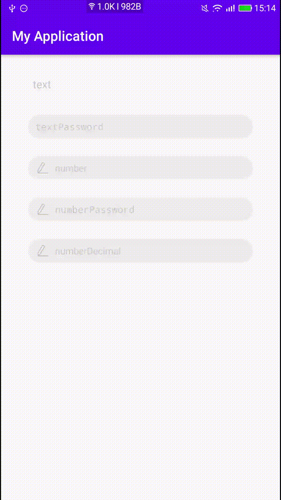

# 自定义EditText
- 可自定义左侧图标，右删除图标

### 自定义属性
```
	<?xml version="1.0" encoding="utf-8"?>
<resources>
    <declare-styleable name="ClearEditView">
        <attr name="background" format="reference" />              <!--背景-->
        <attr name="left_drawable" format="reference" />            <!--左侧图标-->
        <attr name="right_drawable" format="reference" />           <!--右侧图标-->
        <attr name="left_show" format="boolean" />                  <!--是否显示左侧图标-->
        <attr name="right_show" format="boolean" />                 <!--是否显示右侧图标-->
        <attr name="text" format="string" />                        <!--设置文字内容-->
        <attr name="text_size" format="dimension|integer" />        <!--文字大小-->
        <attr name="text_color" format="color" />                   <!--文字颜色-->
        <attr name="hint" format="string" />                        <!--hint内容-->
        <attr name="hint_color" format="color" />                   <!--hint颜色-->
        <attr name="text_padding_left" format="dimension|integer" />    <!--editText中padding left 值-->
        <attr name="text_padding_right" format="dimension|integer" />   <!--editText中padding right 值-->
        <attr name="text_padding_top" format="dimension|integer" />     <!--editText中padding top 值-->
        <attr name="text_padding_bottom" format="dimension|integer" />  <!--editText中padding bottom 值-->
        <attr name="inputType">                         <!--editText的inputType属性-->
            <enum name="text" value="0" />
            <enum name="textPassword" value="1" />
            <enum name="number" value="2" />
            <enum name="numberPassword" value="3" />
            <enum name="numberDecimal" value="4" />
        </attr>
    </declare-styleable>
</resources>
```


---

### 布局案例
```
<?xml version="1.0" encoding="utf-8"?>
<LinearLayout xmlns:android="http://schemas.android.com/apk/res/android"
    xmlns:app="http://schemas.android.com/apk/res-auto"
    xmlns:tools="http://schemas.android.com/tools"
    android:id="@+id/container"
    android:layout_width="match_parent"
    android:layout_height="match_parent"
    android:orientation="vertical"
    android:paddingLeft="@dimen/activity_horizontal_margin"
    android:paddingTop="@dimen/activity_vertical_margin"
    android:paddingRight="@dimen/activity_horizontal_margin"
    android:paddingBottom="@dimen/activity_vertical_margin"
    tools:context=".ui.login.LoginActivity">

    <com.example.myapplication.ui.ClearEditView
        android:id="@+id/password"
        android:layout_width="match_parent"
        android:layout_height="wrap_content"
        android:layout_marginStart="24dp"
        android:layout_marginTop="8dp"
        android:layout_marginEnd="24dp"
        app:hint="text" />

    <com.example.myapplication.ui.ClearEditView
        android:layout_width="match_parent"
        android:layout_height="wrap_content"
        android:layout_marginStart="24dp"
        android:layout_marginTop="26dp"
        android:layout_marginEnd="24dp"
        app:inputType="textPassword"
        app:background="@drawable/shape_bg"
        app:hint="textPassword"
        app:right_show="true"
        app:text_padding_left="10dp"
        app:text_size="14sp" />

    <com.example.myapplication.ui.ClearEditView
        android:layout_width="match_parent"
        android:layout_height="wrap_content"
        android:layout_marginStart="24dp"
        android:layout_marginTop="26dp"
        android:layout_marginEnd="24dp"
        android:paddingLeft="5dp"
        app:inputType="number"
        app:background="@drawable/shape_bg"
        app:hint="number"
        app:left_show="true"
        app:text_padding_left="10dp"
        app:text_size="14sp" />

    <com.example.myapplication.ui.ClearEditView
        android:layout_width="match_parent"
        android:layout_height="wrap_content"
        android:layout_marginStart="24dp"
        android:layout_marginTop="26dp"
        android:layout_marginEnd="24dp"
        android:paddingLeft="5dp"
        app:inputType="numberPassword"
        app:background="@drawable/shape_bg"
        app:hint="numberPassword"
        app:left_show="true"
        app:right_show="true"
        app:text_padding_left="10dp"
        app:text_size="14sp" />

    <com.example.myapplication.ui.ClearEditView
        android:layout_width="match_parent"
        android:layout_height="wrap_content"
        android:layout_marginStart="24dp"
        android:layout_marginTop="26dp"
        android:layout_marginEnd="24dp"
        android:paddingLeft="5dp"
        app:inputType="numberDecimal"
        app:background="@drawable/shape_bg"
        app:hint="numberDecimal"
        app:left_show="true"
        app:right_show="true"
        app:text_padding_left="10dp"
        app:text_size="14sp" />


</LinearLayout>
```

---

